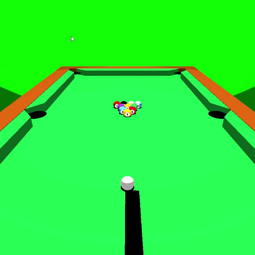

# Graficas

Aquí se pueden encontrar los ejercicios que se realizaran a lo largo del curso. El objetivo es presentar de manera ordenada el trabajo hecho.

# Ejercicio 1: Iniciales del nombre


# Tarea 1

Informe del estado final de esta entrega [aqui](https://github.com/felipe-mr1/Graficas/blob/ed0551d55561c1b1d9ef7f45e397facdacd19703/informes/Reporte%20Grafica%20t1a.pdf)

## Motivación y objetivo

Realizar un puequeño juego en donde tras una infeccion zombie ataca a los humanos y estos pueden estar infectados e infectar a otros. El personaje principal debe llegar a la tienda a conseguir comida para sobrevivir sin ser alcanzado por algun zombie o alguien infectado.

El objetivo es usar los conocimientos aprendidos en el curso y usar la libreria proporcionada por el profesor para poder implementar este juego.

## Resultado

El comando para correr el programa es

```python
survival.py Z H T P
```

En el siguiente gif se puede visualizar el estado final del juego


# Tarea 2

Informe del estado final de esta entrega [aqui](https://github.com/felipe-mr1/Graficas/blob/7bd3dda55274636627cfe6a7344cb5cb693a23cb/informes/Reporte%20Gr%C3%A1fica%20T2b.pdf)

## Motivación y objetivo

Realizar un modelo que pueda bailar. Para esta entrega se aprovecha de los contenidos vistos como curvas para poder realizar los movimientos continuos de las distintas partes del cuerpo ademas de la ilumincación presente en la escena. La iluminación presente corresponde a cel-shading la cual da un efecto carituresco pero también se puede cambiar a una iluminacion normal con los controles indicados en el informe.

## Resultado

El comando para correr el programa es

```python
dance_celshading.py
```

En el siguiente gif se puede visualizar el estado final del programa


# Tarea 3

Informe del estado final de esta entrega [aqui](https://github.com/felipe-mr1/Graficas/blob/7bd3dda55274636627cfe6a7344cb5cb693a23cb/informes/Reporte%20Grafica%20t3b.pdf)

## Motivación y objetivo

A partir de los contenidos aprendidos a lo largo del curso para esta entrega hay que aplicar el conepto de colisiones con ecuaciones diferenciales. La idea es simular un juego de pool tratando de implementar la mayor parte de fisica presente en este juego más los elementos ya vistos en el curso (texturas, ilumnacionn, traslacion, etc). Cabe mencionar que este programa tambien considera algunos controles de usuario que estan detallados en el informe.

## Resultado

Para correr el programa se necesita un archivo config.json que considere el factor de fricción cinetica como 'friccion' y un coeficiente de restitución como 'restitucion'.

```python
pool_party.py config.json
```

En el siguiente gif se puede visualizar el estado final del programa


